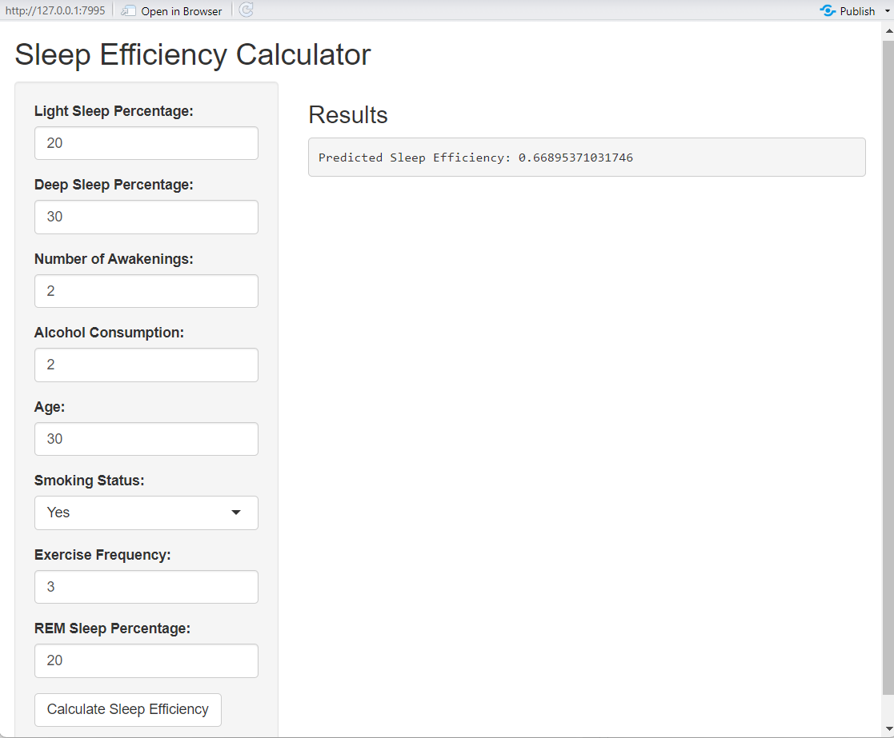
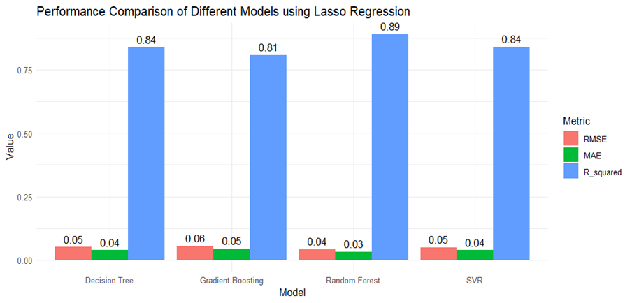
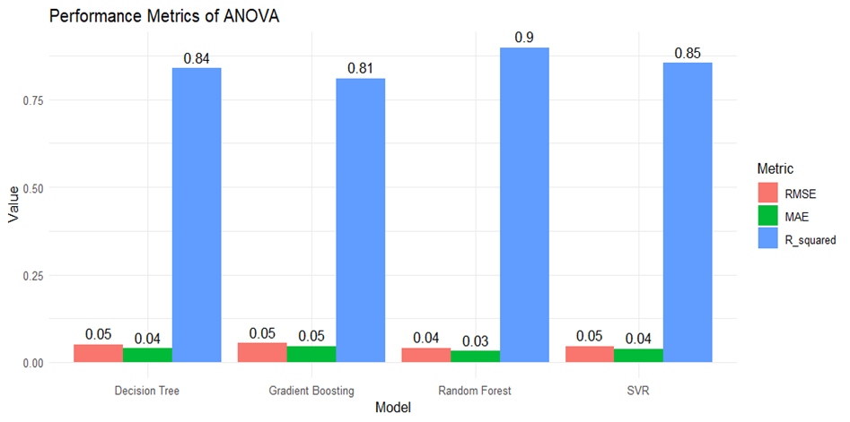
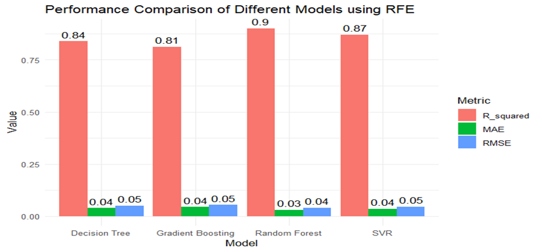
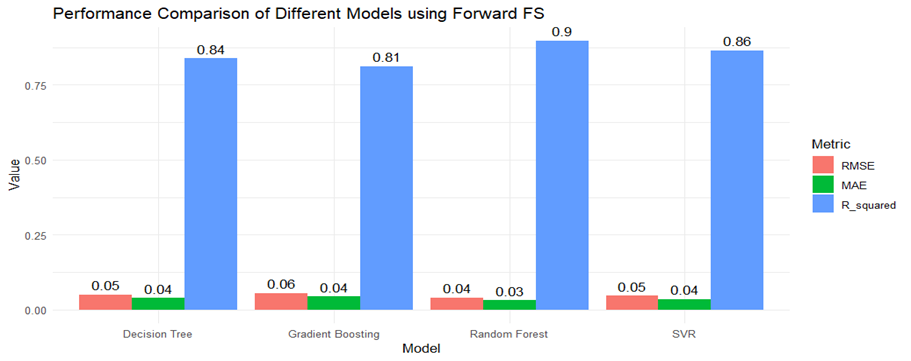

# Sleep Efficiency Prediction Project

This project predicts **Sleep Efficiency** (ratio of time asleep to time in bed) using machine learning techniques on lifestyle and sleep-stage data, and deploys the final model as an interactive **Shiny App**.

---

## 🚀 Main Features

* **End-to-End Pipeline**

  * Data preprocessing (cleaning, imputation, encoding)
  * Feature selection (RFE, Lasso, ANOVA, Forward Selection)
  * Model training and validation (Decision Tree, Random Forest, SVR, Gradient Boosting)
  * Evaluation metrics: R², RMSE, MAE
* **Best Model**: Random Forest + RFE-selected \~8 features (R² ≈ 0.90)
* **Deployment**: Interactive Shiny app for real-time predictions
* **Explainability**: Feature importance & interpretability methods included (Permutation Importance, PDP/ICE, optional SHAP)

---

## 🖥️ Shiny App

The app allows users to input:

* Light/Deep/REM Sleep %
* Awakenings
* Alcohol consumption
* Age
* Smoking status
* Exercise frequency

**Output**: Predicted Sleep Efficiency with optional interpretation.

---

## 📊 Results & Visuals

### Shiny App Output

### Feature Importance using different Feature Selection Methods (Barplots)

* Lasso Regreesion as Feature Selection Bar Plot for different Models.

 

* ANOVA as Feature Selection Bar Plot for different Models.

 

* RFE as Feature Selection Bar Plot for different Models.

* ForwardFS as Feature Selection Bar Plot for different Models.

---

## 🔧 Future Enhancements

* Improved imputation (KNN or missForest)
* Hyperparameter tuning (grid or Bayesian)
* Alternative models (XGBoost, LightGBM)
* Model monitoring for drift in production

---

## 📜 License

Open-source under Apache 2.0 License.
